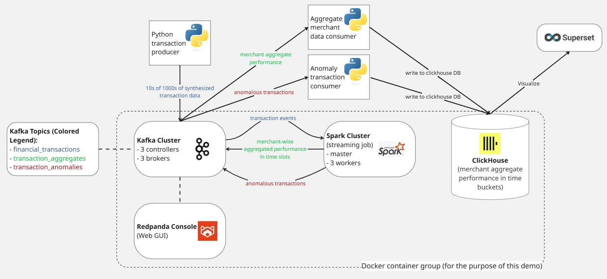
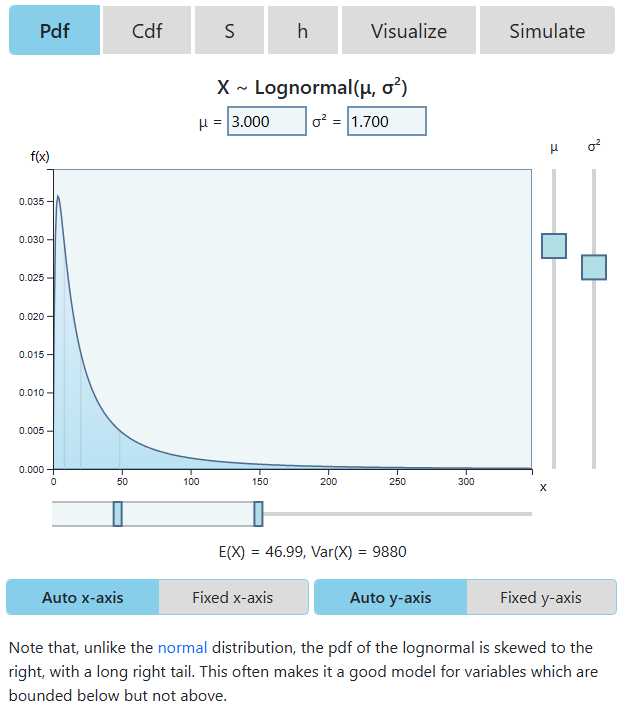

# Intro
This directory contains a project to demo **streaming ETL and visualization of synthesized transactions**.

1. A python script is used to generate synthetic transactions and send them all to a Kafka topic.
2. A spark streaming job is used to perform transformations on the transaction events. 
    - Aggregate performance per merchant (total amount and transaction count) within a time slot.
    - Anomalous transactions (very high value transactions)
    
    The transformed data is written to their own kafka topics.
3. A python script consumes messages from the transformed data's topics and writes them to a clickhouse table.
4. Apache Superset can be used to connect to the clickhouse database to visualize the data.



# Setup
`Python 3.11.14` was used for this project. Other Python versions were not tested. 
1. Build the docker images for the docker container group
    ```bash
    docker compose build
    ```
2. Install the required python packages for the pythons script.
    ```bash
    pip install -r requirements.txt
    ```
    Or use the file with package versions frozen:
    ```bash
    pip install -r requirements_frozen.txt
    ```
3. Have the environmental variables ready (e.g. include these in a `.env` file):
    - CLICKHOUSE_DB - name of the DB in clickhouse to be created and used
    - CLICKHOUSE_PORT - should be 8123
    - CLICKHOUSE_USER - username to be created for clickhouse
    - CLICKHOUSE_PASSWORD - - password to be created for clickhouse
1. Have Superset ready with clickhouse drivers installed.
    This project was done in a Windows environment. Since Superset doesn't support Windows, it was run from a docker image.
    
    **What was done for Windows:**

    The instructions from https://superset.apache.org/docs/6.0.0/quickstart/ and https://superset.apache.org/docs/6.0.0/configuration/databases/ were used to run Superset in development mode via docker.
    - Superset github repo was cloned
        ```bash
        git clone https://github.com/apache/superset
        ```
    - Version 5.0.0 was used.
        ```bash
        git checkout tags/5.0.0
        ```
    - 'clickhouse-connect>=0.6.8' was written to `docker/requirements-local.txt` (file may have to be created). This ensures that the clickhouse drivers will be available to Superset.
    - Now Superset can be launched:
        ```bash
        docker compose -f docker-compose-image-tag.yml up
        ```
        The default credentials can be used (admin for both username and password)
        
# Usage
## Get the stuff running
1. Run the docker container group with the Kafka cluster, Redpanda console for Kafka, Spark cluster and Clickhouse DB.
    ```bash
    docker compose up
    ```
    The spark streaming job (`spark-jobs/spark_jobs.py`) is automatically submitted to the spark cluster.

    This can take a while, wait for the container group to be up and running before following the remaining steps.
2. Launch the 3 python scripts
    ```bash
    python3 transaction_producer.py
    ```
    ```bash
    python3 merchant_performance_consumer.py
    ```
    ```bash
    python3 anomaly_consumer.py
    ```
3. Connect Superset to the clickhouse database
    - If using Superset on windows using the above method (docker container in development mode), db host address must be `host.docker.internal:8123`.
    
## Shutting Down
- Stop each python script using ctrl+c. The scripts will stop gracefully upon receving a keyboard interrupt.
- ```bash
    docker compose down
    ```


## For a fresh start
For a fresh start:
- delete the existing related docker volumes
- delete the `mnt/` folder from the project directory

> [!TIP]
> Clean shutdowns by exiting the producer and consumer python programs, and stopping the container group as described above in the [Shutting Down](##shutting-down) section will negate the need to create a fresh start.

# How the Stuff Works / Technical Details

## Synthesizing Transactions
I wanted to generate transactions with at least some degree of realism.

Real-world transactions have a wide spread, and the higher the amount, the rarer it is.

To randomly generate these transactions I cannot use a normal rand-between or a normal distribution function. Instead I chose a log-normal distribution which allows me to come close to the spread and rarity requirements of transactions. 

I wrote a function to pick a multiplier from the log-normal distribution, which can then be used to multiply a base value. The function is not perfect but will do for now (I wanted calls of the function to average out to the mean value that is passed in, but since I capped the minimum transaction amount to 1 USD, the actual average is higher).
```python
def log_normal_amount(mu=3, sd=1.7, mean = 30) -> float:
    """Return amount taken randomly from log_normal distribution.

    Args:
        mu (int, optional): mu for random.lognormvariate. Defaults to 3.
        sd (float, optional): sigma for random.lognormvariate. Defaults to 1.7.
        mean (int, optional): The expected value u want. Defaults to 30. Actual expected value will be a bit higher as values less than 1.0 are re-rolled.
            With mean = 5 and other parameters at default, average ends up at 9, but higher mean values will be  less affected.

    Returns:
        float: Generated transaction amount.
    """
    amount = 0.0
    while amount < 1.0:
        e = math.pow(math.e, (mu + (sd*sd)/2)) # Expected Value
        multiplier = random.lognormvariate(mu, sd) / e
        amount = round(mean*multiplier, 2)

    return amount
```


The image above is from this playground: https://www.acsu.buffalo.edu/~adamcunn/probability/lognormal.html

This creates a good spread of transactions. Most transactions tend towards the left of the amount axis, but occasionally very high amounts are generated.

> [!NOTE]
> For the purpose of this demo, the transactions with very high amounts will be flagged, with the intention of simulating how real banks would manually review such transactions.

## ClickHouse
I'm using ClickHouse for the analytical database. ClickHouse is column-oriented by default, which will speed up analytical queries (https://clickhouse.com/docs/development/architecture).

2 tables will be used:
- **merchant_perf** - shows performance per merchant within processed time slots
- **anomalies** - contains transactions that are flagged as anomalous (very high value transactions that might be manually reviewed by a bank).

In ClickHouse, the term 'primary key' does not have the meaning it does with normal relational DBMSs. Instead it servers as a sort of 'ordering key', which can be used to 'order' the table. Ordering the table along commonly queries / filtered fields can speed up queries. 

To this end, appropriate fields were chosen for these ordering keys for each of the 2 tables (see the ORDER BY lines):
```sql
CREATE TABLE merchant_perf (timestamp DateTime, merchantId UInt8, totalAmount UInt32, transactionCount UInt32) 
ENGINE MergeTree 
ORDER BY (merchantId, timestamp);
```
```sql
CREATE TABLE anomalies (
    timestamp DateTime,
    transactionId UUID,
    userId String,
    amount Float32,
    transactionTime Int32,
    merchantId Enum('merchant_1', 'merchant_2', 'merchant_3'),
    transactionType Enum('purchase', 'refund'),
    location String,
    paymentMethod Enum('credit_card', 'paypal', 'bank_transfer'),
    isInternational Bool,
    currency Enum('USD', 'EUR', 'LKR')
) 
ENGINE MergeTree 
ORDER BY (timestamp);
```

> [!NOTE]
> `DateTime` type was used for the timestamp instead of `DateTime64`. The precision of `DateTime` is enough for this use case (1 second precision) and it only takes up 4 bytes as opposed to the other's 8 bytes (https://clickhouse.com/docs/use-cases/time-series/date-time-data-types).
