# Table of Contents
- [Intro](#intro)
- [Setup](#setup)
- [Usage](#usage)
    - [Get the stuff running](#get-the-stuff-running)
    - [Shutting Down](#shutting-down)
    - [For a fresh start](#for-a-fresh-start)
- [How the Stuff Works / Technical Details](#how-the-stuff-works--technical-details)
    - [Synthesizing Transactions](#synthesizing-transactions)
    - [Kakfa Cluster and Topic Setup](#kakfa-cluster-and-topic-setup)
    - [Spark Cluster and Streaming Job](#spark-cluster-and-streaming-job)
    - [Consumer Scripts](#consumer-scripts)
    - [ClickHouse](#clickhouse)
- [Visualizing using Superset](#visualizing-using-superset)
    - [Connection](#connection)

# Intro
This directory contains a project to demo **streaming ETL and visualization of synthesized transactions**. This project was adapted and extended from a great tutorial (https://youtu.be/d6AFh31fO7Y?si=en-dJ21Ud4Mmwzcx) by [CodeWithYu](https://www.youtube.com/@CodeWithYu).

Here we are simulating a financial institution that has to deal with many incoming transactions per second.

1. A python script is used to generate synthetic transactions and send them all to a Kafka topic.
2. A spark streaming job is used to perform transformations on the transaction events. 
    - Aggregate performance per merchant (total amount and transaction count) within a time slot.
    - Anomalous transactions (very high value transactions)
    
    The transformed data is written to their own kafka topics.
3. A python script consumes messages from the transformed data's topics and writes them to a clickhouse table.
4. Apache Superset can be used to connect to the clickhouse database to visualize the data.


# Setup
`Python 3.11.14` was used for this project. Other Python versions were not tested. 
1. Build the docker images for the docker container group
    ```bash
    docker compose build
    ```
2. Install the required python packages for the pythons script.
    ```bash
    pip install -r requirements.txt
    ```
    Or use the file with package versions frozen:
    ```bash
    pip install -r requirements_frozen.txt
    ```
3. Have the environmental variables ready (e.g. include these in a `.env` file):
    - CLICKHOUSE_DB - name of the DB in clickhouse to be created and used
    - CLICKHOUSE_PORT - should be 8123
    - CLICKHOUSE_USER - username to be created for clickhouse
    - CLICKHOUSE_PASSWORD - - password to be created for clickhouse
4. Have Superset ready with clickhouse drivers installed.
    This project was done in a Windows environment. Since Superset doesn't support Windows, it was run from a docker image.
    
    **What was done for Windows:**

    The instructions from https://superset.apache.org/docs/6.0.0/quickstart/ and https://superset.apache.org/docs/6.0.0/configuration/databases/ were used to run Superset in development mode via docker.
    - Superset github repo was cloned
        ```bash
        git clone https://github.com/apache/superset
        ```
    - Version 5.0.0 was used.
        ```bash
        git checkout tags/5.0.0
        ```
    - 'clickhouse-connect>=0.6.8' was written to `docker/requirements-local.txt` (file may have to be created). This ensures that the clickhouse drivers will be available to Superset.
    - Now Superset can be launched:
        ```bash
        docker compose -f docker-compose-image-tag.yml up
        ```
        The default credentials can be used (admin for both username and password)
    > [!WARNING]
    > Creating superset like this from the source code can take a long time. At the start, messages on the terminal will be from superset_init and superset_db. When you see messages from superset_worker and superset_app, superset will be close to launching.
        
# Usage
## Get the stuff running
1. Run the docker container group with the Kafka cluster, Redpanda console for Kafka, Spark cluster and Clickhouse DB.
    ```bash
    docker compose up
    ```
    The spark streaming job (`spark-jobs/spark_jobs.py`) is automatically submitted to the spark cluster.

    This can take a while, wait for the container group to be up and running before following the remaining steps.
2. Launch the 3 python scripts
    ```bash
    python3 transaction_producer.py
    ```
    ```bash
    python3 merchant_performance_consumer.py
    ```
    ```bash
    python3 anomaly_consumer.py
    ```
3. Connect Superset to the clickhouse database
    - If using Superset on windows using the above method (docker container in development mode), db host address must be `host.docker.internal:8123`.
    
## Shutting Down
- Stop each python script using ctrl+c. The scripts will stop gracefully upon receving a keyboard interrupt.
- ```bash
    docker compose down
    ```


## For a fresh start
For a fresh start:
- delete the existing related docker volumes
- delete the `mnt/` folder from the project directory

> [!TIP]
> Clean shutdowns by exiting the producer and consumer python programs, and stopping the container group as described above in the [Shutting Down](#shutting-down) section will negate the need to create a fresh start.

# How the Stuff Works / Technical Details

## Synthesizing Transactions
I wanted to generate transactions with at least some degree of realism.

Real-world transactions have a wide spread, and the higher the amount, the rarer it is.

To randomly generate these transactions I cannot use a normal rand-between or a normal distribution function. Instead I chose a log-normal distribution which allows me to come close to the spread and rarity requirements of transactions. 

I wrote a function to pick a multiplier from the log-normal distribution, which can then be used to multiply a base value. The function is not perfect but will do for now (I wanted calls of the function to average out to the mean value that is passed in, but since I capped the minimum transaction amount to 1 USD, the actual average is higher).
```python
def log_normal_amount(mu=3, sd=1.7, mean = 30) -> float:
    """Return amount taken randomly from log_normal distribution.

    Args:
        mu (int, optional): mu for random.lognormvariate. Defaults to 3.
        sd (float, optional): sigma for random.lognormvariate. Defaults to 1.7.
        mean (int, optional): The expected value u want. Defaults to 30. Actual expected value will be a bit higher as values less than 1.0 are re-rolled.
            With mean = 5 and other parameters at default, average ends up at 9, but higher mean values will be  less affected.

    Returns:
        float: Generated transaction amount.
    """
    amount = 0.0
    while amount < 1.0:
        e = math.pow(math.e, (mu + (sd*sd)/2)) # Expected Value
        multiplier = random.lognormvariate(mu, sd) / e
        amount = round(mean*multiplier, 2)

    return amount
```


The image above is from this playground: https://www.acsu.buffalo.edu/~adamcunn/probability/lognormal.html

This creates a good spread of transactions. Most transactions tend towards the left of the amount axis, but occasionally very high amounts are generated.

> [!NOTE]
> For the purpose of this demo, the transactions with very high amounts will be flagged, with the intention of simulating how real banks would manually review such transactions.

Running this simulation on my laptop yielded upwards of 20,000 transactions per second (72 million transactions per hour) (~10 MB of data per minute without counting replication and partitioning within the Kafka cluster). Since this demo is setup to run on personal computers, the production rate will depend greatly on the hardware and its usage.
An example transaction:
```json
{
    "transactionId":"79452541-2e51-491e-890b-a0292e4a95dc",
    "userId":"user_87",
    "amount":7.68,
    "transactionTime":1765963861,
    "merchantId":"merchant_3",
    "transactionType":"refund",
    "location":"location_32",
    "paymentMethod":"bank_transfer",
    "isInternational":true,
    "currency":"USD"
}
```

The `transaction_producer.py` file writes the synthesized transactions to the Kafka topic.
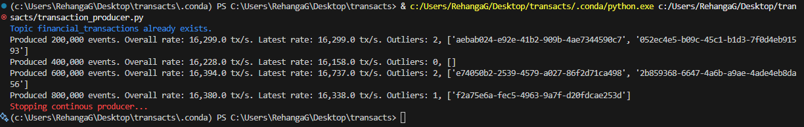


## Kakfa Cluster and Topic Setup
The `docker-compose.yaml` file is setup to create 3 Kafka controllers and 3 Kafka brokers, as well as a console - the Redpanda console which provides a web GUI for the Kafka cluster.

When the 3 brokers are created, a bash script will configure our kafka topics and some other policies (`kafka-init/init.sh`) (see `init-kafka` service in `docker-compose.yaml`).

As seen in the `kafka-init/init.sh` file, the 3 topics we need are created: 
- **financial_transactions** - raw transactions that are generated are held here
- **transaction_aggregates** - holds messages containing the performance of each merchant within a spark micro-batch time period (amount and number of transactions)
- **transaction_anomalies** - hold transactions identified by the spark streaming job, as been anomalous / need manual review by the bank (very high amount)
The replication factor of each topic is set to 3, for redundancy, so each of our brokers will hold the data. 'financial_transactions' topic partition count is set to 5, while the rest are set to 1 for the purpose of this demo. (The `transaction_aggregates` and `transaction_anomalies` topics will each have 1 consumer pythons script consuming from it, so 1 partition is fine).

In Kafka clusters, we may want to delete old data due to storage constraints. When running this demo on my laptop, the 'financial_transactions' topic would accumualate a few gigabytes (it's easily the biggest topic by a huge margin). In the `kafka-init/init.sh` file, a delete policy is created for the 'financial_transactions' topic. Old data is deleted after reaching a few GBs (refer the comments in `kafka-init/init.sh` for the calculation).

> [!NOTE]
> Redpanda console can be accesssed at http://localhost:8080

The Redpanda console can be used to view the topics and other Kafka related stuff. Below are screenshots of the overview and topic sections.

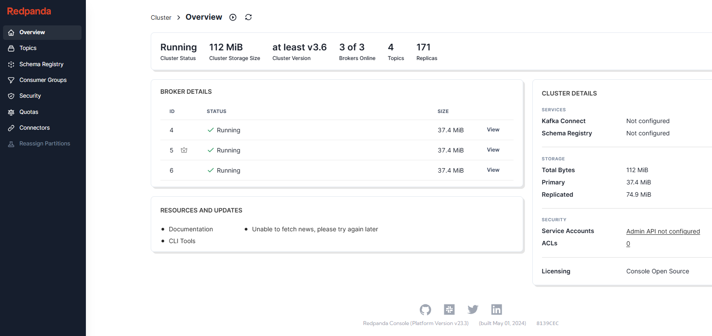
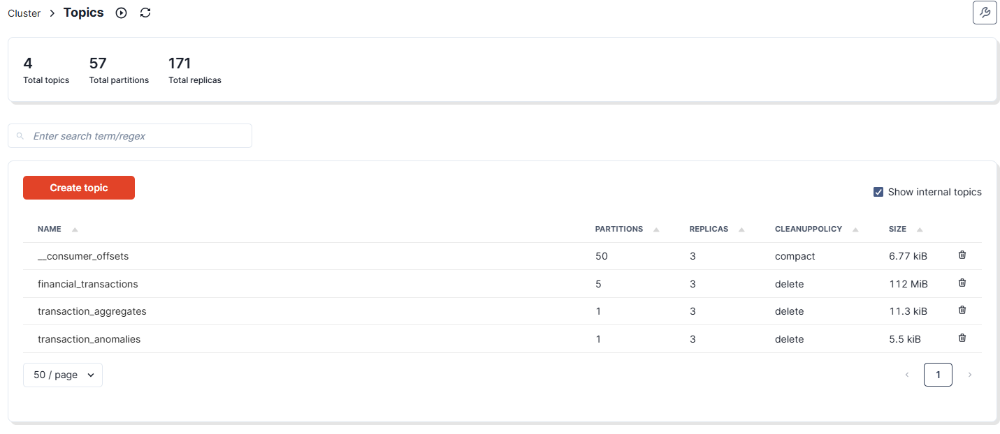
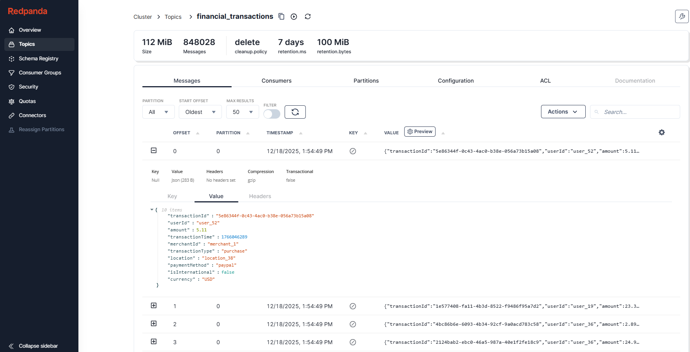


## Spark Cluster and Streaming Job

The `docker-compose.yaml` file is setup to create a single spark master and 3 spark workers. The `spark-jobs/` folder is mounted to all spark containers, and contains the python script defining the 2 spark streaming jobs (`spark-jobs/spark_jobs.py`).  The `init-spark` service in the `docker-compose.yaml` file runs the `spark-jobs/init.sh` shell script and exits. The script submits the aforementioned spark job to the spark master when at least one kafka broker is ready.

The `spark-jobs/init.sh` shell script also specifies the java packages that must be installed and used by the spark processes. The package installation location is mapped in the `docker-compose.yaml` file to point to the `ivy-cache` folder in this project directory. This way, once the packages are installed, they don't need to be re-installed in subsequent runs.

There are 2 spark streaming jobs (queries):
- **Merchant Performance Aggregator** - Accumulates the performance per merchant using all the transaction records found in one micro-batch. This data is sent as a message to the `transaction_aggregates` topic. An example message is given below (this message would be timestamped in the topic).
    ```json
    {
        "merchantId":"merchant_1",
        "totalAmount":309567.2600000002,
        "transactionCount":8551
    }
    ```
    
- **Anomaly Finder** - Flags very high value transactions from the `financial_transactions` topic and sends them to the `transaction_anomalies` topic as is.

> [!NOTE]
> The spark GUI can be accessed at http://localhost:4041

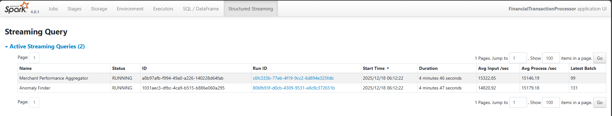

The spark cluster can keep up with the rate of transactions been written to the Kafka topic. We can see that each micro-batch processes around 20,000 messages.

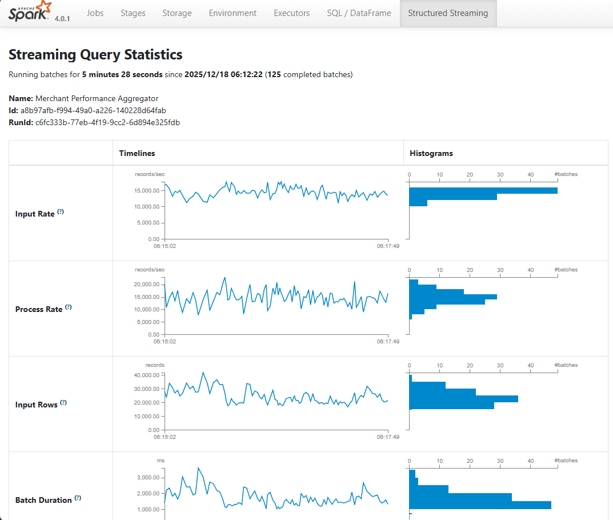
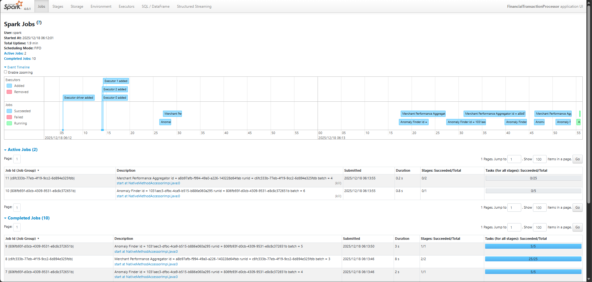

## Consumer Scripts
The 2 consumer scripts (`anomaly_consumer.py` and `merchant_performance_consumer.py`) are responsible for reading the messages in the `transaction_aggregates` and `transaction_anomalies` topics, and writing them to the ClickHouse DB. 

Below is a screenshot of the consumer groups section from the Redpanda console for the Kafka cluster.
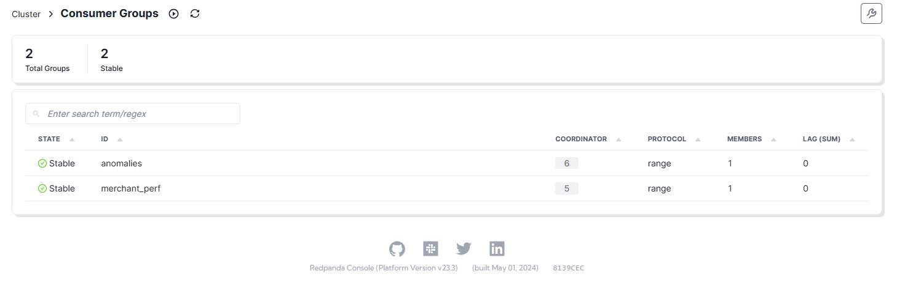

To recap, these 2 topics contain the processed outputs from the 2 spark streaming jobs.

The read messages are written to 2 tables in ClickHouse.
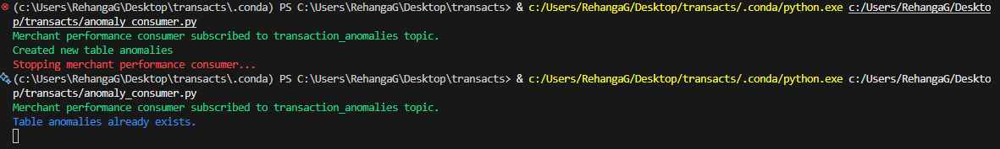

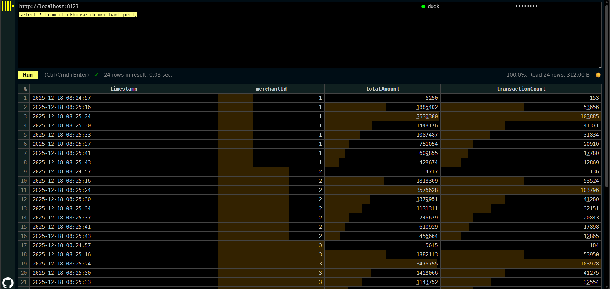

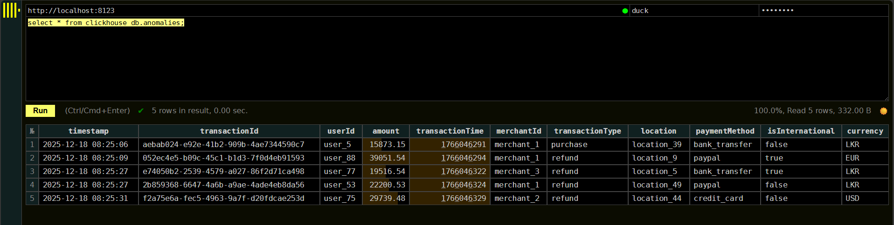

## ClickHouse
I'm using ClickHouse for the analytical database. ClickHouse is column-oriented by default, which will speed up analytical queries (https://clickhouse.com/docs/development/architecture).

> [!NOTE]
> The ClickHouse web-GUI can be accessed at http://localhost:8123

2 tables will be used:
- **merchant_perf** - shows performance per merchant within processed time slots
- **anomalies** - contains transactions that are flagged as anomalous (very high value transactions that might be manually reviewed by a bank).

In ClickHouse, the term 'primary key' does not have the meaning it does with normal relational DBMSs. Instead it servers as a sort of 'ordering key', which can be used to 'order' the table. Ordering the table along commonly queries / filtered fields can speed up queries. 

To this end, appropriate fields were chosen for these ordering keys for each of the 2 tables (see the ORDER BY lines):
```sql
CREATE TABLE merchant_perf (timestamp DateTime, merchantId UInt8, totalAmount UInt32, transactionCount UInt32) 
ENGINE MergeTree 
ORDER BY (merchantId, timestamp);
```
```sql
CREATE TABLE anomalies (
    timestamp DateTime,
    transactionId UUID,
    userId String,
    amount Float32,
    transactionTime Int32,
    merchantId Enum('merchant_1', 'merchant_2', 'merchant_3'),
    transactionType Enum('purchase', 'refund'),
    location String,
    paymentMethod Enum('credit_card', 'paypal', 'bank_transfer'),
    isInternational Bool,
    currency Enum('USD', 'EUR', 'LKR')
) 
ENGINE MergeTree 
ORDER BY (timestamp);
```

> [!NOTE]
> `DateTime` type was used for the timestamp instead of `DateTime64`. The precision of `DateTime` is enough for this use case (1 second precision) and it only takes up 4 bytes as opposed to the other's 8 bytes (https://clickhouse.com/docs/use-cases/time-series/date-time-data-types).

# Visualizing using Superset
## Connection
> [!NOTE]
> With the Windows setup described in the [Setup](#setup) section, Superset can be accessed at http://localhost:8088

To use Superset, we must connect it to our ClickHouse database. The python package 'clickhouse-connect>=0.6.8' is needed for the necessary drivers. For Windows, this was covered in the [Setup](#setup) section where the docker image was built from Superset's repo. 

If using Superset on windows using the above method (docker container in development mode), db host address must be `host.docker.internal:8123`.

Afterwards the Superset GUI can be used to configure the connection to the database (https://clickhouse.com/docs/integrations/superset).

> [!WARNING]
> For some reason it can take more than one try of clicking the 'connect' button in Superset to connect to the ClickHouse database. 